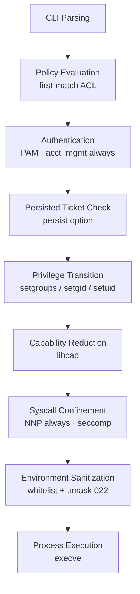

# Voix


## Privilege Policy Enforcement Runtime

Voix is a user-space Privilege Policy Enforcement Runtime designed to evaluate authorization policies, construct controlled execution contexts, and enforce privilege and syscall-level boundaries during command execution on Unix-like systems.

It operates as a deterministic execution broker between user intent and privileged system operations. While it may provide compatibility with `sudo`-like workflows, it is architecturally distinct from traditional privilege escalation utilities and is not intended as a drop-in wrapper.

---

## 1. System Model

Voix implements a staged execution pipeline for privileged command invocation:



Each stage is strictly ordered and failure-atomic where applicable. Any violation of required invariants results in termination prior to execution.

> [!NOTE]
> All identity resolution happens **before** `fork()`; the child performs no
> name-service lookups between `fork()` and `execve()`.

---

## 2. Core Responsibilities

Voix is responsible for:

* Evaluating structured authorization policies (YAML-based ACL model)
* Determining whether an execution request is permitted
* Constructing a constrained execution context for permitted operations
* Applying privilege transitions and security hardening based on target execution tier
* Delegating authentication to PAM where required
* Enforcing syscall and capability restrictions for non-privileged execution targets
* Executing the final binary within the prepared context

Voix does not interpret shell logic, provide a scripting environment, or manage long-lived sessions beyond optional authentication persistence mechanisms.

---

## 3. Execution Tiers

Voix defines two primary execution tiers:

### Privileged Target Execution
Targets such as `root` or system service users.
* Full Linux capabilities retained
* No seccomp filtering applied
* No resource limits imposed by Voix
* Environment is sanitized but not confined
* Intended for compatibility with system-level operations

### Non-Privileged Target Execution
All non-root execution targets.
* All capabilities dropped
* `PR_SET_NO_NEW_PRIVS` enforced
* Seccomp syscall blacklist applied
* Resource limits enforced (RLIMIT_* policies)
* Environment fully sanitized to a restricted whitelist

---

## 4. Security Model

Voix follows a defense-in-depth model consisting of:

* Policy-driven authorization (ACL evaluation)
* System authentication delegation (PAM integration)
* Privilege separation via fork/exec transition
* Capability reduction via `libcap`
* Syscall filtering via `libseccomp`
* Environment sanitization to eliminate injection vectors
* Explicit denial of privilege escalation paths post-transition

The security boundary is enforced at process creation time and is not dynamically adjusted after execution begins.

---

## 5. Configuration Model

Voix uses a structured YAML configuration file (`/etc/voix.conf`) to define execution policy.

Configuration is divided into:
* `core`: Execution environment parameters (paths, sanctuary)
* `acl`: Authorization rules for users and groups
* `security`: Global restrictions and blocklists

Policies are evaluated deterministically and matched against:
* User identity
* Group membership
* Requested command path
* Optional argument constraints

### Configuration Example
For a full example, see `[config/voix.conf](config/voix.conf)`.

```yaml
# Voix configuration
core:
  sanctuary: /tmp
  paths:
    - /bin
    - /sbin
    - /usr/bin
    - /usr/sbin

acl:
  group:
    wheel:
      - action: permit
        options: [trust]

security:
  profiles:
    restricted:
      retain_full_capabilities: false
      enable_seccomp: true
      enable_resource_limits: true
      scrub_environment: true
    privileged:
      retain_full_capabilities: true
      enable_seccomp: false
      enable_resource_limits: false
      scrub_environment: false
  blocklist:
    - /bin/sh
```

---

## 6. Authentication Model

Authentication is delegated to the system PAM stack under the `voix` service context.
Authentication is required unless explicitly bypassed via policy-level trust options.
Voix does not implement its own credential storage or verification system.

---

## 7. Design Constraints

* Implemented in C++26
* Built exclusively with Clang toolchain
* Minimal external dependency surface
* Deterministic policy evaluation
* No dynamic plugin execution model
* No embedded shell interpreter

---

## 8. Compatibility Note

Voix may be used in workflows similar to `sudo` or `doas` for operational familiarity. However, this is a compatibility layer of usage, not a reflection of its internal architecture or design intent.

---

## Build and Installation

### Prerequisites
- **LLVM Clang Toolchain**
- **C++26** compliant environment
- **CMake** (v3.30+) and **Ninja**
- Core dependencies: `yaml-cpp`, `pam`. Optional: `libcap`, `libseccomp`.

### Build Instructions
1. **Clone the repository**:
    ```bash
    git clone https://github.com/Veridian-Zenith/Voix.git && cd Voix
    ```
2. **Configure and Build**:
    ```bash
    cmake -B build -G Ninja -DCMAKE_EXPORT_COMPILE_COMMANDS=ON -DCMAKE_INSTALL_PREFIX=/usr -DCMAKE_BUILD_TYPE=Release
    cmake --build build
    ```
3. **Install**:
    ```bash
    sudo cmake --install build
    ```

### Distribution Specifics
- **Arch Linux**: Install via AUR: `paru -S voix` or `yay -S voix`.
- **Other Distributions**: Refer to the `[packaging/](packaging/)` directory for guidance.

---

## Documentation

Consult the following technical guides in the `[docs/](docs/)` directory:
- **[Voix Overview](VOIX.md)**: Comprehensive reference document.
- **[Threat Model](THREATS.md)**: Analysis of attack surface and mitigations.
- **[CLI Reference](docs/CLI.md)**: Command-line interface and flag specifications.
- **[Configuration Guide](docs/CONFIG.md)**: Detailed guidance on `/etc/voix.conf`.
- **[Sudo Compatibility](docs/SUDO.md)**: Using Voix as a functional alternative to `sudo`.
- **[Seccomp Analysis](docs/SECCOMP.md)**: Syscall filtering and containment.
- **[Testing Suite](docs/TESTING.md)**: Verification and integrity testing.

---

## Usage

After installation, ensure the PAM configuration at `/etc/pam.d/voix` is aligned with your security policy.

**Execution Syntax:**
```bash
voix <command> [args...]
```

**Common Options:**

- <kbd>-u</kbd> `USER`: Execute as a specific target user.
- <kbd>-n</kbd>: Non-interactive mode (fail if authentication is required).
- <kbd>-k</kbd>: Invalidate the persisted authentication timestamp (`persist` tickets).
- <kbd>-C</kbd> `FILE`: Use an alternative configuration file.
- <kbd>-l</kbd>: List permitted commands for the current user.

---

## Troubleshooting

<details>
<summary><b>"PAM authentication failed"</b></summary>

Verify that the PAM configuration at `/etc/pam.d/voix` matches your system's
authentication stack (most distributions can `include system-auth`).
Account-level failures (expired password, locked account) are also reported
here — account validation always runs, even for `trust` rules.
</details>

<details>
<summary><b>"Permission denied"</b></summary>

Check the user/group authorization rules in `/etc/voix.conf`. Remember that
rules without a `target:` field only apply to the default target
(<code>root</code>); switching users requires an explicit
<code>target: USER</code> rule. Validate your policy with
<code>voix -c</code>.
</details>

<details>
<summary><b>"Insufficient privileges" at startup</b></summary>

The binary must be setuid root (mode <code>4755</code>) or carry equivalent
file capabilities. Reinstall with
<code>sudo cmake --install build</code>.
</details>

---

## License
Voix is distributed under the Open Software License v3.0 (OSL-3.0). See [`LICENSE`](./LICENSE) for details.


## CLI Options (v4.13.0)
- `-C/--config FILE`  - `-c/--check-config`  - `-n` (non-interactive)
- `-s` (shell ascension)  - `-l/--list` (permitted commands)  - `-E/--preserve-env`  - `-H/--home`  - `-i/--login`  - `-k` (invalidate auth timestamps)
