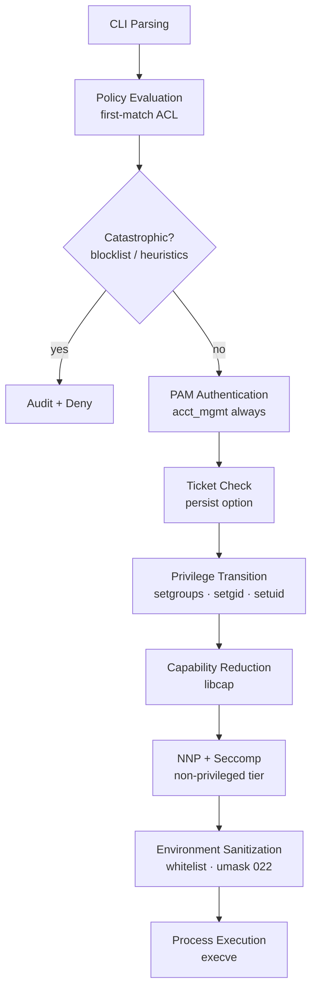
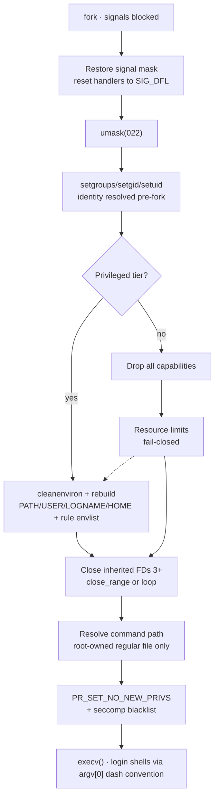

# Voix

## Privilege Policy Enforcement Runtime

Voix is a user-space Privilege Policy Enforcement Runtime for Unix-like operating systems. It evaluates authorization policies, constructs controlled execution contexts, and enforces privilege and syscall-level boundaries during command execution.

It operates as a deterministic execution broker between user intent and privileged system operations. While it may provide compatibility with `sudo`-like workflows, it is architecturally distinct from traditional privilege escalation utilities and is not intended as a drop-in wrapper.

---

## 1. System Model

Voix implements a staged execution pipeline for privileged command invocation:



Each stage is strictly ordered and failure-atomic where applicable. Any violation of required invariants results in termination prior to execution.

---

## 2. Core Responsibilities

Voix is responsible for:

* Evaluating structured authorization policies (YAML-based ACL model)
* Determining whether an execution request is permitted
* Constructing a constrained execution context for permitted operations
* Applying privilege transitions and security hardening based on target execution tier
* Delegating authentication to PAM where required
* Enforcing syscall and capability restrictions for non-privileged execution targets
* Executing the final binary within the prepared context

Voix does not interpret shell logic, provide a scripting environment, or manage long-lived sessions beyond optional authentication persistence mechanisms.

---

## 3. Execution Tiers

Voix defines two primary execution tiers:

### Privileged Target Execution

Targets listed in `core.unconfined_targets` (default: `root`, `alpm`) or assigned a `privileged` security profile.

* Full Linux capabilities retained
* No seccomp filtering applied
* No resource limits imposed by Voix
* Full inherited environment preserved (including `LD_*`, `PYTHON*`, and other loader/interpreter variables)
* Inherited file descriptors are **not** closed
* Intended for compatibility with system-level operations (package manager hooks, process management)

### Non-Privileged Target Execution

All other execution targets.

* All capabilities dropped via `libcap`
* `PR_SET_NO_NEW_PRIVS` enforced
* Seccomp syscall blacklist applied
* Resource limits enforced (`RLIMIT_NOFILE`, `RLIMIT_NPROC`, `RLIMIT_CORE`)
* Environment fully sanitized to a restricted whitelist (`TERM`, `DISPLAY`, `XAUTHORITY`, `LANG`, `PATH`)
* Inherited file descriptors (3+) closed via `close_range` or fallback loop
* Signal handlers reset to `SIG_DFL`

---

## 4. Security Model

Voix follows a defense-in-depth model consisting of:

* **Policy-driven authorization** -- ACL evaluation with first-match semantics
* **System authentication delegation** -- PAM integration under the `voix` service; account validation (`pam_acct_mgmt`) runs on every invocation, even for `trust`/`nopass` rules
* **Persisted authentication timestamps** -- optional per-rule `persist` option stores a 15-minute ticket under `<sanctuary>/timestamp/` (TOCTOU-hardened); `-k` invalidates
* **Privilege separation** -- fork/exec transition prevents the parent from retaining elevated state; all identity resolution happens before `fork()` (no name-service activity in the child)
* **Capability reduction** -- `libcap` strips all capabilities for non-privileged targets
* **Syscall filtering** -- `libseccomp` blocks dangerous syscalls (`kexec_load`, `ptrace`, `bpf`, `userfaultfd`, `keyctl`, `io_uring_setup`, etc.); `PR_SET_NO_NEW_PRIVS` is enforced unconditionally for non-privileged targets, independent of seccomp
* **Environment sanitization** -- eliminates injection vectors (`LD_PRELOAD`, `BASH_ENV`, `ENV`); `keepenv` grants are required for any environment preservation, and a forced `umask 022` stops callers influencing file modes of privileged operations
* **Signal blocking** -- `pthread_sigmask` blocks all signals before `fork()` to prevent signal-based attacks
* **Secure file I/O** -- `O_NOFOLLOW`, effective-UID ownership verification, symlink rejection (TOCTOU protection) for configuration, logs, and timestamp tickets alike
* **Catastrophic command detection** -- basename- and canonicalization-aware blocking of `rm -rf /` variants, `dd` to raw block devices, the `mkfs*` family, and partition/destruction tools, plus admin exact-path and `regex:` blocklist entries
* **Audit logging** -- dual output to `/var/log/voix.log` (symlink-resistant append with control-character escaping to defeat log forging) and syslog (`LOG_AUTHPRIV`); the `nolog` rule option suppresses command text while preserving an outcome-only audit trail

The security boundary is enforced at process creation time and is not dynamically adjusted after execution begins.

---

## 5. Trusted Computing Base

Voix maintains a minimal Trusted Computing Base for transparency and auditability:

| Metric | Traditional Tools (approx.) | Voix | Note |
| :--- | :--- | :--- | :--- |
| **Lines of Code** | ~180,000 | ~3,770 | ~48x smaller attack surface |
| **Test Suite** | varies | ~1,810 lines · 84 tests | Includes adversarial cases |
| **External Dependencies** | Many (varies) | 2 required, 2 optional | `yaml-cpp`, `pam` (required); `libcap`, `libseccomp` (optional) |
| **Binary Size (Release)** | ~1.2 MB | ~802 KB portable / ~549 KB distro build | Portable release bundles yaml-cpp statically (`VOIX_STATIC_YAML_CPP`) |
| **Config Language** | Sudoers (custom) | YAML (standard) | Reduced parsing complexity |
| **CVE History** | Extensive | 0 | New design eliminates legacy bugs |

---

## 6. Configuration Model

Voix uses a structured YAML configuration file (`/etc/voix.conf`) to define execution policy.

### Configuration Sections

#### `core`

| Field | Type | Default | Description |
| :--- | :--- | :--- | :--- |
| `sanctuary` | string | `/tmp` | Temporary working directory for Voix operations |
| `paths` | list | `["/bin", "/sbin", "/usr/bin", "/usr/sbin"]` | Trusted directories for executable resolution |
| `login_shell` | bool | `false` | Whether to default to login shell mode |
| `suppress_stderr` | bool | `true` | Whether to suppress stderr log output |
| `unconfined_targets` | list | `["root", "alpm"]` | Target users receiving full system treatment (retained capabilities, no seccomp, full environment) |

#### `acl`

A mapping of users or groups to authorization rules:

| Field | Type | Required | Description |
| :--- | :--- | :--- | :--- |
| `action` | enum | yes | `permit` or `deny` |
| `options` | list | no | `trust`/`nopass`, `keepenv`, `persist`, `nolog` |
| `profile` | string | no | Named security profile to apply (default: `restricted`) |
| `target` | string | no | User identity to assume (default: `root`) |
| `command` | string | no | Specific command path to authorize |
| `args` | list | no | Argument constraints with `*` and `?` wildcards |

Rules use first-match semantics. A deny-by-default policy means all commands are blocked unless explicitly permitted.

#### `security`

##### `profiles`

Named execution profiles controlling confinement behavior:

| Field | Type | Default | Description |
| :--- | :--- | :--- | :--- |
| `retain_full_capabilities` | bool | `false` | Preserve all Linux capabilities |
| `enable_seccomp` | bool | `true` | Apply seccomp syscall blacklist |
| `enable_resource_limits` | bool | `true` | Enforce `RLIMIT_NOFILE`, `RLIMIT_NPROC`, `RLIMIT_CORE` |
| `scrub_environment` | bool | `true` | Clear and restrict environment variables |
| `preserve_full_environment` | bool | `false` | Preserve entire inherited environment verbatim (for unconfined targets) |

##### `blocklist`

A list of commands and regex patterns that are globally forbidden, checked before policy evaluation.

### Example Configuration

```yaml
core:
  sanctuary: /var/lib/voix
  paths:
    - /bin
    - /sbin
    - /usr/bin
    - /usr/sbin
  unconfined_targets:
    - root
    - alpm

acl:
  group:
    wheel:
      - action: permit
        options: [trust, keepenv]
  user:
    admin:
      - action: permit
        options: [trust]
        profile: privileged
    exiled:
      - action: deny

security:
  profiles:
    restricted:
      retain_full_capabilities: false
      enable_seccomp: true
      enable_resource_limits: true
      scrub_environment: true
    privileged:
      retain_full_capabilities: true
      enable_seccomp: false
      enable_resource_limits: false
      scrub_environment: false
      preserve_full_environment: false
  blocklist:
    - /bin/sh
    - /bin/bash
```

---

## 7. Authentication Model

Authentication is delegated to the system PAM stack under the `voix` service context.

* Authentication is required unless explicitly bypassed via policy-level `trust`/`nopass` options **or** a fresh `persist` timestamp ticket (TTL: 15 minutes)
* **Account validation (`pam_acct_mgmt`) always runs** — expired or disabled accounts are denied even under `trust`/`nopass` rules
* Voix does not implement its own credential storage or verification
* PAM lifecycle: `start` → `authenticate` → `acct_mgmt` → `setcred` → `open_session` → `close_session`; an RAII guard closes the session even when command execution throws
* Password buffers are zeroed via volatile pointer writes with a compiler barrier after use
* Non-interactive mode (`-n`) fails immediately if authentication is required
* `-k` removes the invoking user's persisted ticket; tickets live in `<sanctuary>/timestamp/` with strict owner/mode verification (`O_NOFOLLOW`, mode `0600`, root-only parent directory)

---

## 8. Command-Line Interface

```
voix [options] <command> [args...]
```

### Options

| Flag | Long Form | Description |
| :--- | :--- | :--- |
| `-h` | `--help` | Show help message |
| `-v` | `--version` | Show version information |
| `-u USER` | | Execute as a specific target user (default: root). Requires an explicit `target` rule for non-root users. |
| `-C FILE` | `--config FILE` | Use the specified configuration file (default: `/etc/voix.conf`) |
| `-c` | `--check-config` | Validate the configuration file and exit |
| `-n` | | Non-interactive mode; fail if authentication is required |
| `-s` | | Execute the user's shell (ascend to shell) |
| `-l` | `--list` | List commands permitted for the current user (deny-aware) |
| `-E` | `--preserve-env` | Request environment preservation (requires a `keepenv` policy grant) |
| `-i` | `--login` | Execute in a login shell environment |
| `-k` | | Invalidate the persisted authentication timestamp (`persist` tickets) |

### Examples

```bash
voix ls /root                    # Execute as root
voix -u admin systemctl restart nginx  # Execute as specific user
voix -l                          # List permitted commands
voix -s                          # Start interactive shell
voix -c                          # Validate configuration
```

---

## 9. Build and Installation

### Prerequisites

* **LLVM Clang 22+** toolchain (Clang-only; GCC is not supported)
* **CMake 3.30+** (required for C++26 standard support)
* **Ninja** build system
* **pkg-config**
* **ccache** (optional, for build acceleration)

### Runtime Dependencies

| Library | Required | Purpose |
| :--- | :--- | :--- |
| `yaml-cpp` | yes | YAML configuration parsing |
| `pam` | yes | PAM authentication (`libpam`) |
| `libcap` | optional | Linux capabilities management (`VOIX_ENABLE_CAP`, default: ON) |
| `libseccomp` | optional | Syscall filtering (`VOIX_ENABLE_SECCOMP`, default: ON) |

A minimal build with only `yaml-cpp` and `pam` is possible by disabling the two optional features.

### Build Instructions

```bash
git clone https://github.com/Veridian-Zenith/Voix.git && cd Voix

# Release build
cmake -B build -G Ninja \
  -DCMAKE_EXPORT_COMPILE_COMMANDS=ON \
  -DCMAKE_INSTALL_PREFIX=/usr \
  -DCMAKE_BUILD_TYPE=Release
cmake --build build

# Install (requires root for setuid)
sudo cmake --install build
```

### Debug Build (with tests)

```bash
cmake -B build-debug -G Ninja \
  -DCMAKE_EXPORT_COMPILE_COMMANDS=ON \
  -DCMAKE_INSTALL_PREFIX=/usr \
  -DCMAKE_BUILD_TYPE=Debug
cmake --build build-debug
```

Tests run automatically during Debug builds. If any test fails, the build fails.

### Installation Layout

| Path | Description |
| :--- | :--- |
| `/usr/bin/voix` | Binary (setuid root, mode 4755) |
| `/etc/voix.conf` | Configuration file (root-owned, mode 0600) |
| `/etc/pam.d/voix` | PAM service configuration |
| `/usr/share/man/man1/voix.1` | Man page |

### Distribution Packages

* **Arch Linux**: `paru -S voix` or `yay -S voix` (AUR)
* **Other distributions**: See `packaging/` directory for guidance

---

## 10. Hardening

The build system applies extensive compiler and linker hardening:

### Compiler Flags

| Flag | Purpose |
| :--- | :--- |
| `-fstack-protector-strong` | Stack buffer overflow protection |
| `-fstack-clash-protection` | Stack clash attack prevention |
| `-D_FORTIFY_SOURCE=3` | Fortified libc functions |
| `-ftrivial-auto-var-init=zero` | Deterministic stack initialization (prevents UAF/info-leak) |
| `-fcf-protection=full` | CET indirect-branch + return landing-pad protection |
| `-fvisibility=hidden` | Minimal exported symbol surface |
| `-flto=thin` | Link-Time Optimization |
| `-fPIE` + `-pie` | Position-independent executable |

### Linker Flags

| Flag | Purpose |
| :--- | :--- |
| `--as-needed` | Eliminate unused library dependencies |
| `-z relro -z now` | Full RELRO (read-only GOT) |
| `-z noexecstack` | Non-executable stack |
| `--icf=all` | Identical Code Folding |
| `--strip-all` | Strip all symbols (release) |

---

## 11. Threat Model

### Primary Threat Actor

Local authenticated users attempting to gain unauthorized root privileges or execute privileged operations beyond their assigned scope.

### Attack Vectors

| Vector | Mitigation |
| :--- | :--- |
| **Configuration tampering** | Root ownership enforced; symlink rejection; `O_NOFOLLOW` + `fstat()` TOCTOU protection |
| **Binary exploitation** | Hardened build; minimal TCB; C++26 with modern toolchain |
| **Authentication bypass** | Strict PAM lifecycle; echo-controlled conversation; secure memory zeroing |
| **Command injection** | Environment sanitization; catastrophic command blocklist; path safety verification |
| **Kernel exploitation** | Seccomp blacklist blocks `kexec_load`, `ptrace`, `reboot`, `bpf`, etc. |
| **Signal-based attacks** | `pthread_sigmask` blocks all signals before `fork()` |

### Catastrophic Command Blocklist

The following are hardcoded and cannot be overridden:

* `rm -rf` targeting `/` and variants: root globs (`/*`, `/**`), `//`,
  GNU long options (`--recursive`, `--force`), combined short flags
  (`-Rf`, `-fr`, ...), and cwd-relative arguments that canonicalize to `/`
  (e.g. `.` or `..` executed from `/`)
* `dd` writing to raw block devices: sd/hd/vd/nvme/mmcblk, device-mapper
  (`/dev/mapper`, `/dev/dm-`), `/dev/disk/*` aliases, `/dev/root`, or the
  detected root filesystem device
* The entire `mkfs*` family and `mkswap`
* Partition/destruction tools matched by basename regardless of path prefix:
  `fdisk`, `sfdisk`, `cfdisk`, `parted`, `wipe`, `wipefs`, `shred`

Administrators can extend this via the `security.blocklist` YAML
configuration, using exact paths or `regex:` pattern entries.

---

## 12. Testing

Voix includes 84 unit tests covering:

* Permission checking (allow, deny, group rules, command-specific, first-match deny precedence, pattern matching, listing with deny suppression, target defaulting to root)
* Configuration loading (valid, invalid YAML, nonexistent files, blocklist exact + `regex:` entries + malformed-regex rejection, envlist validation, rule options, unconfined targets, validation)
* Security (user validation, catastrophic commands: rm variants incl. cwd-relative targets, dd device coverage, mkfs family, partition tools; ticket store roundtrip/tampering)
* Command (profile resolution matrix)
* Logger (timestamp format, empty messages, control-character/log-forging sanitization)
* FileUtils (read/write, secure O_NOFOLLOW I/O, symlink rejection, private-directory enforcement, command resolution)
* SystemUtils (UID/GID lookup, passwd lookups, environment management)
* Negative security testing (catastrophic command evasion, path traversal, config tampering, permission bypass, group spoofing, blocklist evasion, command injection, environment injection, user validation injection)

### Running Tests

```bash
# Debug build (tests run automatically)
cmake -B build-debug -G Ninja -DCMAKE_BUILD_TYPE=Debug
cmake --build build-debug

# Force-enable tests in Release
cmake -B build -DCMAKE_BUILD_TYPE=Release -DBUILD_TESTING=ON -G Ninja
cmake --build build
```

### Code Quality

```bash
clang-tidy -p build-debug src/*.cpp include/*.hpp -- -Iinclude -std=c++26
```

---

## 13. Architecture

### Module Overview

| Module | Class | Role |
| :--- | :--- | :--- |
| `voix.hpp/cpp` | `Voix` | Main orchestrator: config load, auth, permission, execution, audit gating (`nolog`) |
| `command.hpp/cpp` | `Command` | Fork/exec engine, privilege transition (pre-fork identity), env sanitization, profile resolution |
| `config.hpp/cpp` | `Config` | YAML config loading, rule parsing, security profiles, exact + `regex:` blocklist |
| `security.hpp/cpp` | `Security` | User validation, catastrophic commands, capabilities, seccomp blacklist |
| `authenticator.hpp/cpp` | `PamAuthenticator` | PAM lifecycle (acct_mgmt always), persisted timestamps |
| `ticket_store.hpp/cpp` | `TicketStore` | TOCTOU-hardened per-UID authentication tickets under `<sanctuary>/timestamp/` |
| `permission_checker.hpp/cpp` | `PermissionChecker` | ACL rule evaluation, UID/GID matching, pattern matching, deny-aware listing |
| `rule.hpp` | `Rule` | Data model for authorization rules (incl. `envlist`, `nolog`, `persist`, `pattern`) |
| `file_utils.hpp/cpp` | `FileUtils` | Secure file I/O (`O_NOFOLLOW` reads/writes, private directories), path validation, command resolution |
| `logger.hpp/cpp` | `Logger` | Dual-output audit logging with control-character escaping and syslog fallback |
| `policy_analyzer.hpp/cpp` | `PolicyAnalyzer` | Semantic policy linting for `--check-config` |
| `pam_utils.hpp/cpp` | `pam_conversation` | PAM conversation with echo control |
| `system_identity.hpp/cpp` | `SystemIdentity` | System identity lookups (testable abstraction) |
| `system_utils.hpp/cpp` | `SystemUtils` | UID/GID resolution, passwd lookups, environment helpers |

### Execution Flow (Child Process)



> [!NOTE]
> Steps 5, 6, 8 and 10 apply only to the **non-privileged tier**. Privileged
> targets (package-manager workflows) retain full capabilities, an unrestricted
> syscall surface and their inherited environment by design.

### Design Patterns

* **Interface abstraction** (`IAuthenticator`, `IIdentity`) for dependency injection and test mocking
* **RAII wrappers** for `cap_t` (`UniqueCap`) and `seccomp_filter_ctx` (`UniqueSeccomp`)
* **`std::expected<T, E>`** for type-safe error handling in file operations
* **`std::ranges`** for modern C++ algorithm usage
* **First-match semantics** for ACL rule evaluation

---

## 14. Compatibility Note

Voix may be used in workflows similar to `sudo` or `doas` for operational familiarity. To create a drop-in experience:

```bash
# Shell alias
alias sudo=voix

# Or symlink
sudo ln -s /usr/bin/voix /usr/local/bin/sudo
```

However, this is a compatibility layer of usage, not a reflection of its internal architecture or design intent.

---

## 15. Design Constraints

* Implemented in C++26
* Built exclusively with LLVM/Clang toolchain
* Minimal external dependency surface
* Deterministic policy evaluation
* No dynamic plugin execution model
* No embedded shell interpreter

---

## 16. Documentation Index

| Document | Content |
| :--- | :--- |
| [THREATS.md](THREATS.md) | Threat model, TCB metrics, attack surface analysis |
| [docs/CLI.md](docs/CLI.md) | Command-line interface reference |
| [docs/CONFIG.md](docs/CONFIG.md) | Configuration guide (YAML schema) |
| [docs/SUDO.md](docs/SUDO.md) | Sudo/doas drop-in replacement guide |
| [docs/SECCOMP.md](docs/SECCOMP.md) | Seccomp sandboxing architecture |
| [docs/TESTING.md](docs/TESTING.md) | Testing suite documentation |
| [CONTRIBUTING.md](CONTRIBUTING.md) | Contribution guidelines |
| [TODO.md](TODO.md) | Project roadmap and known issues |

---

## License

Voix is distributed under the Open Software License v3.0 (OSL-3.0). See [LICENSE](./LICENSE) for details.

---

Copyright (C) 2026 Veridian Zenith. Architected by Dae Euhwa.
