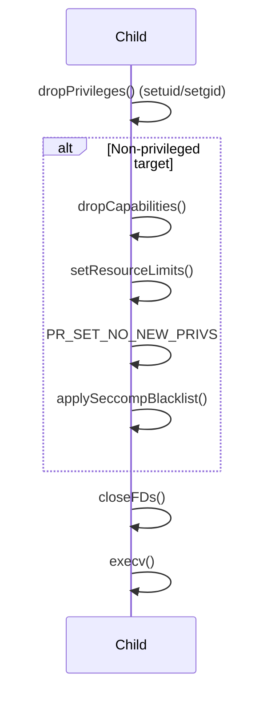

# Seccomp Sandboxing Architecture Design

## Overview

This document outlines the architecture for integrating Seccomp (Secure Computing mode) into the Voix application to enhance security by restricting system calls in the child process.

## Security Posture

The application will adopt a **blacklist policy**. This approach blocks a set of known dangerous or unnecessary system calls while allowing others. This balances security with compatibility, as it avoids breaking commands that may require unexpected system calls, while still mitigating common attack vectors.

## Integration Strategy

### 1. Implementation

- **Dependency**: Use `libseccomp` for cross-platform, robust Seccomp filter generation.
- **New Method**: Implement `Security::applySeccompBlacklist()` in `src/security.cpp`.
- **Integration Point**: `Command::execute()` in `src/command.cpp` calls this method in the child process, after privilege dropping, capability dropping, environment setup, resource limits, and FD closing. This ensures seccomp is the final confinement step before `execv()`.

### 2. Workflow

The process flow in the child process is as follows. Note that capability dropping, resource limits, and seccomp are only applied to **non-privileged target users**. Privileged targets (root, package manager) retain full access since voix's purpose is to grant root-level privileges.

### 3. Blacklist Strategy

Voix blocks the following syscalls for non-privileged targets:

| Category | Syscalls |
| :--- | :--- |
| Kernel/image | `kexec_load`, `bpf` |
| Loadable modules | `init_module`, `finit_module`, `delete_module` |
| System state | `reboot`, `swapon`, `swapoff` |
| Process inspection / injection | `ptrace`, `process_vm_readv`, `process_vm_writev` |
| Kernel-object attack surface | `userfaultfd`, `perf_event_open`, `io_uring_setup` |
| Keyring | `keyctl`, `add_key`, `request_key` |
| Handle-based filesystem escape | `open_by_handle_at`, `name_to_handle_at` |

These syscalls are frequent targets for privilege escalation, container
escapes, or system disruption.

> [!NOTE]
> `PR_SET_NO_NEW_PRIVS` is applied **unconditionally** for non-privileged
> targets — even when seccomp is disabled by policy (`security.seccomp: false`
> or a profile with `enable_seccomp: false`). Executed setuid binaries can
> therefore never regain privileges regardless of filter configuration.

### 4. Error Handling

Filter construction is fail-closed:

- If the filter context cannot be initialized or loaded, the child immediately calls `_exit(1)` rather than executing unsandboxed.
- Per-rule additions returning `-ENOSYS` or `-EOPNOTSUPP` (the syscall does not exist on this architecture) are tolerated so a single filter definition serves every supported architecture.
- Any other rule-addition error is fatal.

### 5. Allowlist Mode (`seccomp_mode: allowlist`)

When a profile sets `seccomp_mode: allowlist`, `applySeccompAllowlist()` is
invoked instead of the blacklist. It uses `SCMP_ACT_KILL` as the default (denying
all syscalls) and explicitly allows the 19 permitted syscalls listed above
via `SCMP_ACT_ALLOW`. See `docs/CONFIG.md` (`security.profiles`) and
`security.cpp`.

## Future Considerations

The allowlist profile (`seccomp_mode: allowlist`) provides the default-deny
posture; extending it with additional permitted syscalls for specific command
profiles is a future enhancement.
