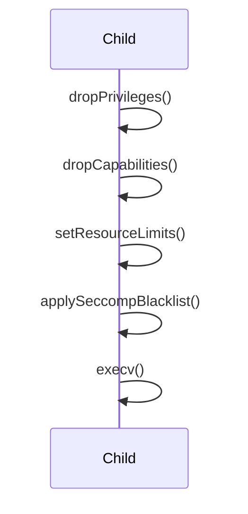

# Seccomp Sandboxing Architecture Design

## Overview

This document outlines the architecture for integrating Seccomp (Secure Computing mode) into the Voix application to enhance security by restricting system calls in the child process.

## Security Posture

The application will adopt a **blacklist policy**. This approach blocks a set of known dangerous or unnecessary system calls while allowing others. This balances security with compatibility, as it avoids breaking commands that may require unexpected system calls, while still mitigating common attack vectors.

## Integration Strategy

### 1. Implementation

- **Dependency**: Use `libseccomp` for cross-platform, robust Seccomp filter generation.
- **New Method**: Implement `Security::applySeccompBlacklist()` in `src/security.cpp`.
- **Integration Point**: `Command::execute()` in `src/command.cpp` will call this method within the child process (immediately after privilege and capability dropping).

### 2. Workflow

The process flow in the child process will be updated as follows:

### 3. Blacklist Strategy

The following syscalls are identified for the initial blacklist:

- `kexec_load`
- `delete_module`
- `init_module`
- `finit_module`
- `reboot`
- `swapon`
- `swapoff`

These syscalls are often targets for privilege escalation or system disruption.

### 4. Error Handling

If `Security::applySeccompBlacklist()` fails to initialize the filter or apply the rules, the child process must immediately call `_exit(1)` to ensure it does not execute the command in an un-sandboxed state.

## Future Considerations

While a blacklist provides immediate security benefits, a **default-deny whitelist policy** is recommended as a future enhancement for even stronger security. This would require profiling to identify all necessary syscalls for the commands permitted by Voix.
